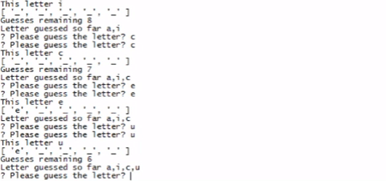

# hangman-node-js
A node js application for command line game hangman

This application divides the code into 2 main constructor files and a game file with core logic. 
  * word constructor
    It has an pool of words available for the hangman game to be used.
  * letter constructor
    This uses word exported from the previous file and replaces it with underscore so it is hidden from the user.
   
  * game file
    Includes the main logic of the hangman game. 
    It keeps track of user guesses, replaces the word with correctly guessed letter and reports wins and losses to the user based on their     guesses.
 
 

## Preview of the game
